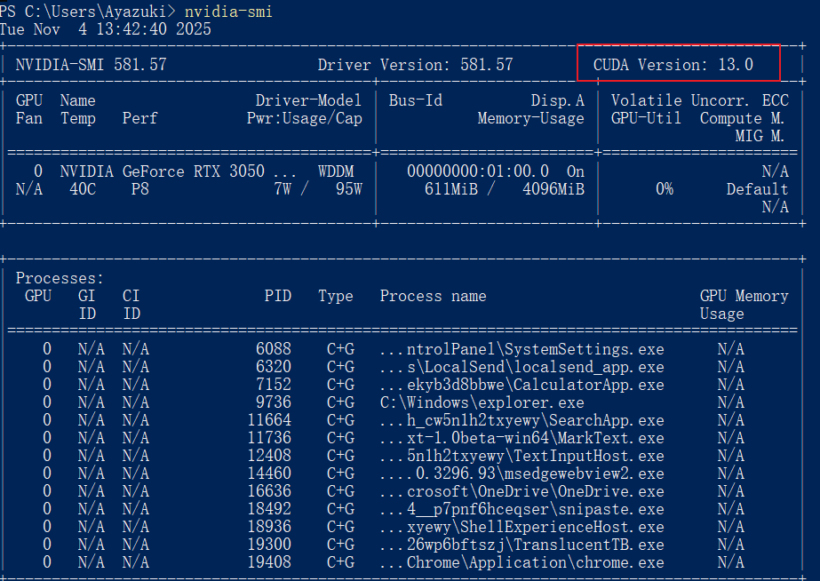
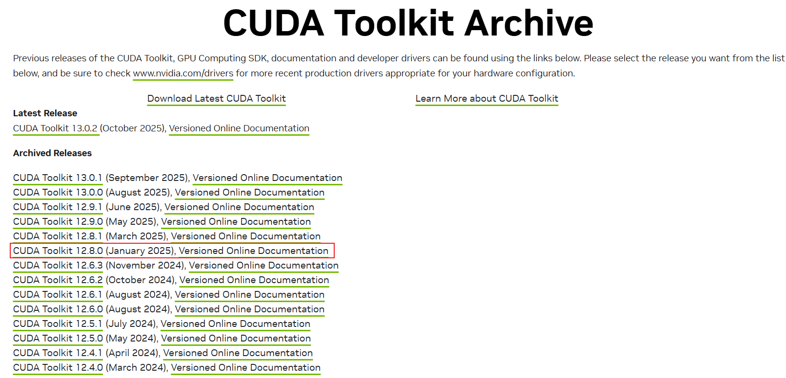
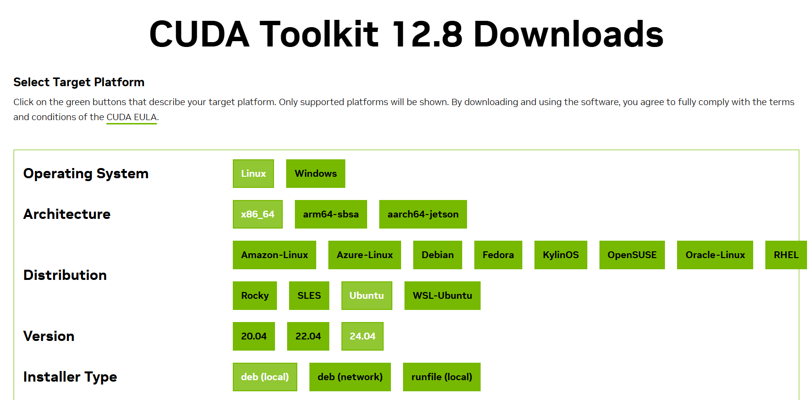
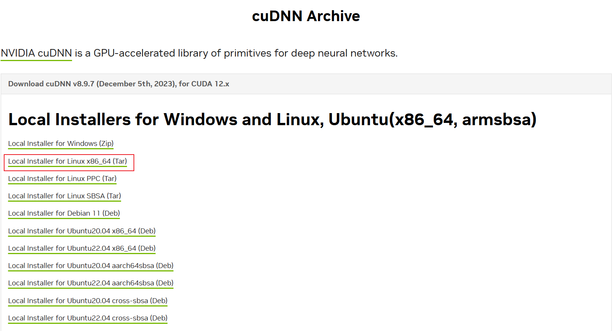

# Linux环境下配置mamba环境

# 环境要求：

- Python = 3.10

- CUDA = 12.8

- CUDNN = 8.9.7

- PyTorch = 2.7

- Linux (本文采用的是基于Windows10系统的WSL安装的Ubuntu-24.04)

# Anaconda的安装

参考[在Linux环境下配置Anaconda](https://20040506.xyz/post/zai-Linux-huan-jing-xia-pei-zhi-Anaconda.html)

# CUDA ToolKit下载

首先在自己Windows终端输入`nvidia-smi`确认CUDA的最大支持版本号



我这里是最大支持CUDA 13.0，所以后面我选择安装CUDA ToolKit 12.8版本

[CUDA ToolKit官网]([CUDA Toolkit Archive | NVIDIA Developer](https://developer.nvidia.com/cuda-toolkit-archive))



选择适合的型号



最后官方给出了安装方式

```Linux
wget https://developer.download.nvidia.com/compute/cuda/repos/ubuntu2404/x86_64/cuda-ubuntu2404.pin
sudo mv cuda-ubuntu2404.pin /etc/apt/preferences.d/cuda-repository-pin-600
wget https://developer.download.nvidia.com/compute/cuda/12.8.0/local_installers/cuda-repo-ubuntu2404-12-8-local_12.8.0-570.86.10-1_amd64.deb
sudo dpkg -i cuda-repo-ubuntu2404-12-8-local_12.8.0-570.86.10-1_amd64.deb
sudo cp /var/cuda-repo-ubuntu2404-12-8-local/cuda-*-keyring.gpg /usr/share/keyrings/
sudo apt-get update
sudo apt-get -y install cuda-toolkit-12-8
```

接下来进入到Ubuntu终端执行命令安装CUDA ToolKit 12.8.这里需要注意的是第三行命令，文件会有点大(3.8G)，因为国内的网络环境问题，推荐复制链接`https://developer.download.nvidia.com/compute/cuda/12.8.0/local_installers/cuda-repo-ubuntu2404-12-8-local_12.8.0-570.86.10-1_amd64.d` 跳转到Windows浏览器内下载好，然后移动到Ubuntu系统里进行安装。
这里我选择提前下载好deb文件然后本地安装，所以我们只需要依次执行以下命令：

```Linux
wget https://developer.download.nvidia.com/compute/cuda/repos/ubuntu2404/x86_64/cuda-ubuntu2404.pin
sudo mv cuda-ubuntu2404.pin /etc/apt/preferences.d/cuda-repository-pin-600
sudo dpkg -i cuda-repo-ubuntu2404-12-8-local_12.8.0-570.86.10-1_amd64.deb
sudo cp /var/cuda-repo-ubuntu2404-12-8-local/cuda-*-keyring.gpg /usr/share/keyrings/
sudo apt-get update
sudo apt-get -y install cuda-toolkit-12-8
```

### 注意

```Linux
ubuntu24@Ayazuki-PC:~$ sudo dpkg -i cuda-repo-ubuntu2404-12-8-local_12.8.0-570.86.10-1_amd64.deb
Selecting previously unselected package cuda-repo-ubuntu2404-12-8-local.
(Reading database ... 40768 files and directories currently installed.)
Preparing to unpack cuda-repo-ubuntu2404-12-8-local_12.8.0-570.86.10-1_amd64.deb ...
Unpacking cuda-repo-ubuntu2404-12-8-local (12.8.0-570.86.10-1) ...
Setting up cuda-repo-ubuntu2404-12-8-local (12.8.0-570.86.10-1) ...

The public cuda-repo-ubuntu2404-12-8-local GPG key does not appear to be installed.
To install the key, run this command:
sudo cp /var/cuda-repo-ubuntu2404-12-8-local/cuda-47045A0D-keyring.gpg /usr/share/keyrings/
```

执行`sudo dpkg -i cuda-repo-ubuntu2404-12-8-local_12.8.0-570.86.10-1_amd64.deb` 出现了以上报错，报错的原因是显示未安装 `cuda-repo-ubuntu2404-12-8-local `的公共 GPG 密钥,这里需要执行`sudo cp /var/cuda-repo-ubuntu2404-12-8-local/cuda-47045A0D-keyring.gpg /usr/share/keyrings/` 来安装密钥，接下来在继续执行`sudo dpkg -i cuda-repo-ubuntu2404-12-8-local_12.8.0-570.86.10-1_amd64.deb` 。

依次执行全部命令后，接下来配置CUDA的环境变量。在终端执行`sudo vim ~/.bashrc`，在文件末尾添加以下内容:

```Linux
export PATH=/usr/local/cuda-12.8/bin:$PATH
export LD_LIBRARY_PATH=/usr/local/cuda-12.8/lib64:$LD_LIBRARY_PATH
export CUDA_HOME=/usr/local/cuda-12.8
```

接下来执行`source ~/.bashrc`,在当前 shell 会话中重新加载并执行 ~/.bashrc 文件中的所有命令，然后在终端输入`nvcc --ersion`,期望输出为：

```Linux
nvcc: NVIDIA (R) Cuda compiler driver
Copyright (c) 2005-2025 NVIDIA Corporation
Built on Wed_Jan_15_19:20:09_PST_2025
Cuda compilation tools, release 12.8, V12.8.61
Build cuda_12.8.r12.8/compiler.35404655_0
```

至此，说明CUDA的环境变量已经配置完成。

# cuDNN安装



将文件放置在Ubuntu中，输入`tar -xvf cudnn-linux-x86_64-8.9.7.29_cuda12-archive.tar.xz`执行解压.

解压完成后输入`cd cudnn-linux-x86_64-8.9.7.29_cuda12-archive`进入该目录下，执行

`sudo cp -r ./lib/* /usr/local/cuda-12.8/lib64/`

`sudo cp -r ./include/* /usr/local/cuda-12.8/include/`

接下来修改权限

`sudo chmod a+r /usr/local/cuda-12.8/include/cudnn*`
`sudo chmod a+r /usr/local/cuda-12.8/lib64/libcudnn*`

# 配置mamba环境

在终端输入`conda create --name mamba python=3.10`创建一个mamba专属的虚拟环境。

由于后续安装的mamba和causal_conv1d的pytorch版本一般在2.4-2.7之间，这里选择安装老版本的pytorch。

[安装以往的 PyTorch 版本 ](https://pytorch.ac.cn/get-started/previous-versions/)

输入`pip install torch==2.7.0 torchvision==0.22.0 torchaudio==2.7.0 --index-url https://download.pytorch.org/whl/cu128`安装pytorch，需要注意的是：使用conda命令下载最后得到的包文件名为pytorch，使用pip得到的包名是torch。

安装pytorch后，现在可以测试一下之前cuDNN的配置是否有效，在终端输入`python check_cuda.py`执行check_cuda.py

```python
# check_cuda.py
import torch
# 1. 检查 CUDA 是否可用
print("CUDA available:", torch.cuda.is_available())
# 2. 检查 cuDNN 是否启用
print("cuDNN enabled:", torch.backends.cudnn.enabled)
# 3. 查看 cuDNN 版本
print("cuDNN version:", torch.backends.cudnn.version())
# 4. 查看当前使用的 GPU
if torch.cuda.is_available():
    print("GPU:", torch.cuda.get_device_name(0))
```

输出

```
CUDA available: True
cuDNN enabled: True
cuDNN version: 90701
GPU: NVIDIA GeForce RTX 3050 Laptop GPU
```

说明之前配置的cuDNN正常运行。

接下来执行`conda install packaging ninja`安装后续编译所需要的包文件。

前期工作准备完成，现在开始编译安装causal-conv1d，进入[causal-conv1d项目](https://github.com/Dao-AILab/causal-conv1d)的发行页，下载与版本号匹配的whl文件，将文件放到Ubuntu里进行编译安装。

causal_conv1d-1.5.4是causal_conv1d的版本号，本文采用的cuda是12.8，torch是2.7，python是3.10，经过筛选后发现只有两个文件匹配，一个是causal_conv1d-1.5.4+cu12torch2.7cxx11abiFALSE-cp310-cp310-linux_x86_64.whl，另一个是causal_conv1d-1.5.4+cu12torch2.7cxx11abiTRUE-cp310-cp310-linux_x86_64.whl，**这两者最大的不同是cxx11abi是TRUE还是FALSE**。cxx11abi更准确地说是 GLIBCXX_USE_CXX11_ABI，它是 GCC在 C++11 标准库 ABI变更中引入的一个编译宏控制开关，直接影响 C++ 程序的二进制兼容性。**因为 PyTorch框架的预编译 wheel 包是在特定 ABI 下编译的。如果你本地环境 ABI 不匹配，就会出错！**

我们可以运行check_cxx11abi.py来查看我们的cxx11abi情况来选择适合的whl文件。

```python
# check_cxx11abi.py
import torch
print("PyTorch compiled with _GLIBCXX_USE_CXX11_ABI =", torch._C._GLIBCXX_USE_CXX11_ABI)
```

输出

```
PyTorch compiled with _GLIBCXX_USE_CXX11_ABI = True
```

所以本文选取**causal_conv1d-1.5.4+cu12torch2.7cxx11abiTRUE-cp310-cp310-linux_x86_64.whl**进行编译安装causal_conv1d。将下载好的whl文件移动到Ubuntu中，执行`pip install causal_conv1d-1.5.4+cu12torch2.7cxx11abiTRUE-cp310-cp310-linux_x86_64.whl`编译安装causal_conv1d。

接下来执行check_conv1d.py验证causal_conv1d包安装情况。

```python
# check_conv1d.py
import torch
from causal_conv1d import causal_conv1d_fn
# 假设 batch=2, dim=64, seqlen=128, kernel_width=4
x = torch.randn(2, 64, 128, device='cuda', dtype=torch.float16)
weight = torch.randn(64, 4, device='cuda', dtype=torch.float16)
bias = torch.randn(64, device='cuda', dtype=torch.float16)
out = causal_conv1d_fn(x, weight, bias=bias, activation="silu")
print(out.shape)
```

输出结果

```
torch.Size([2, 64, 128])
#输出形状与输入形状相同，说明causal_conv1d正常工作
```

接下来开始编译安装mamba，进入[Mamba](https://github.com/state-spaces/mamba)的发行页，下载与版本号匹配的whl文件，将文件放到Ubuntu里进行编译安装。执行

`pip install mamba_ssm-2.2.6.post3+cu12torch2.7cxx11abiTRUE-cp310-cp310-linux_x86_64.whl --no-build-isolation`

在官方文档中的 Installation环节，给出了pip编译安装报错的解决方法：尝试向 pip 传递 --no-build-isolation 参数。可解决编译过程中与 PyTorch 版本不匹配的相关报错

执行check_mamba.py验证mamba安装是否正常

```python
# check_mamba.py
import torch
from mamba_ssm import Mamba
batch, length, dim = 2, 64, 16
x = torch.randn(batch, length, dim).to("cuda")
model = Mamba(
    # This module uses roughly 3 * expand * d_model^2 parameters
    d_model=dim, # Model dimension d_model
    d_state=16,  # SSM state expansion factor
    d_conv=4,    # Local convolution width
    expand=2,    # Block expansion factor
).to("cuda")
y = model(x)
assert y.shape == x.shape
```

该程序执行后正常结束无报错信息，说明mamba工作正常

接下来执行check_mamba2.py

```python
# 执行check_mamba2.py
import torch
from mamba_ssm import Mamba2
batch, length, dim = 2, 64, 32
x = torch.randn(batch, length, dim).to("cuda")
model = Mamba2(
    # This module uses roughly 3 * expand * d_model^2 parameters
    d_model=dim, # Model dimension d_model
    d_state=64,  # SSM state expansion factor, typically 64 or 128
    d_conv=4,    # Local convolution width
    expand=2,    # Block expansion factor
).to("cuda")
y = model(x)
assert y.shape == x.shape
```

该程序执行后正常结束无报错信息，说明mamba2工作正常。mamba配置完成

# 参考资料

[Mamba安装-基于mamba源码进行cuda编译](https://github.com/AlwaysFHao/Mamba-Install)

[Mamba](https://github.com/state-spaces/mamba)

[causal-conv1d](https://github.com/Dao-AILab/causal-conv1d)

[win10系统完美配置mamba-ssm全整合方案 | 老潘家的潘老师](https://divertingpan.github.io/post/win-mamba/)
